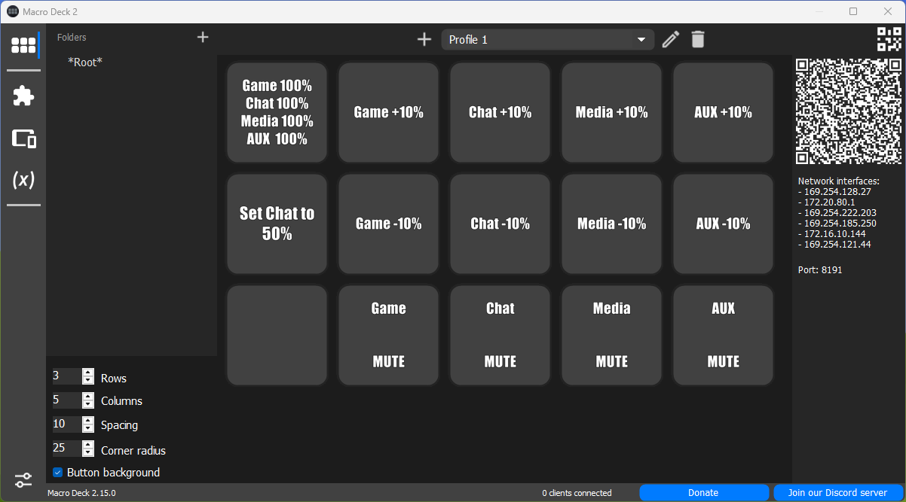
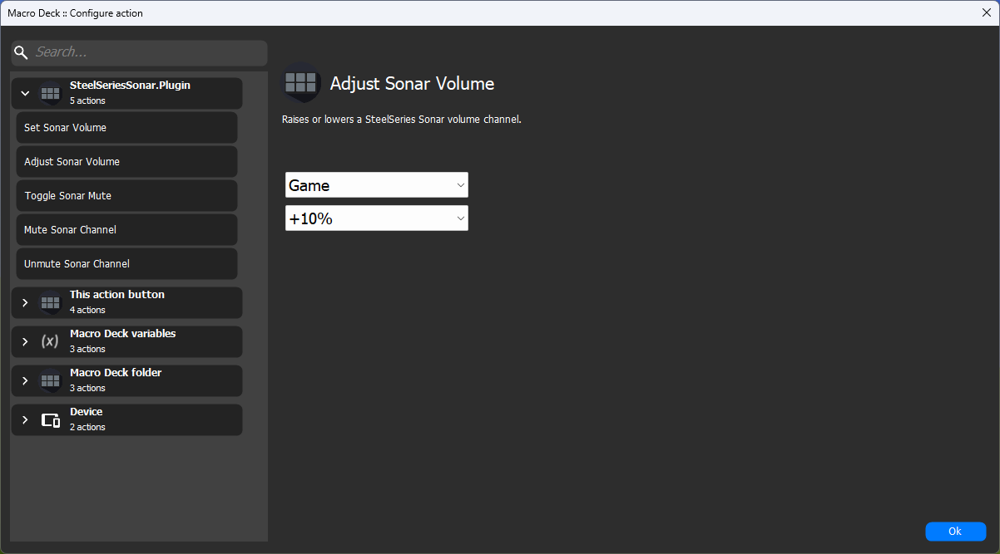
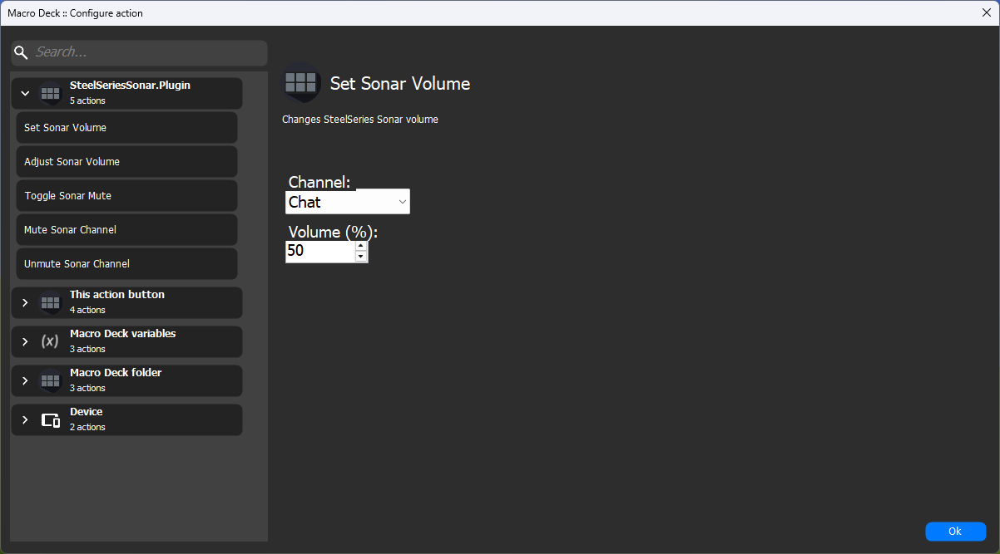
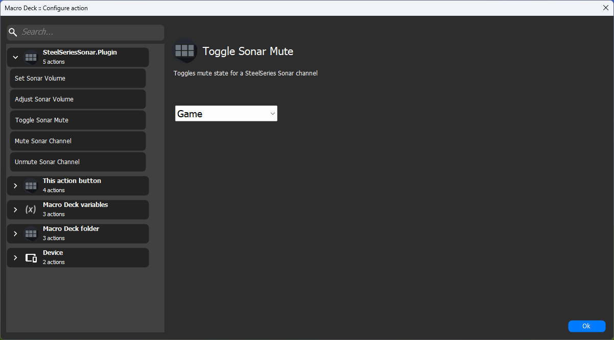
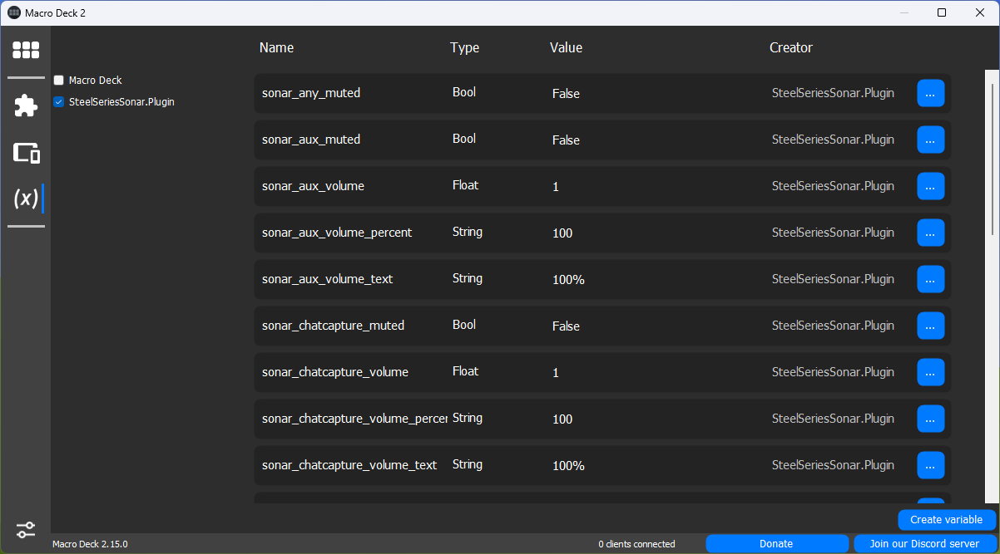

# SteelSeries Sonar Plugin for Macro Deck 2

## Overview

Control SteelSeries Sonar directly from Macro Deck. This plugin provides actions for adjusting volume, muting and unmuting channels, toggling mute state, and exposes Sonar channel variables that can be used to create dynamic button states.

This plugin communicates with the local SteelSeries Sonar HTTP API.
No audio processing or virtual audio drivers are installed or modified by
this plugin.

The plugin communicates with the local SteelSeries Sonar API and does not
require administrator privileges.

## Why this plugin?

SteelSeries Sonar provides an excellent virtual audio mixer, but it does not
offer direct integration with Macro Deck.

This plugin bridges that gap by allowing Macro Deck buttons to control Sonar
channels and react to Sonar's current state using Macro Deck variables.    
	
## Features

- Control Sonar Master, Game, Chat, Mic, Media, and Aux channels
- Set channel volume to a specific level
- Increase or decrease channel volume
- Mute, unmute, and toggle channel mute
- Automatic Macro Deck variable updates
- Dynamic button state support for mute status
- Uses the local SteelSeries Sonar API

## Screenshots







## Requirements

- Windows 11
- Macro Deck 2.15 or later
- SteelSeries GG with Sonar enabled
	
## Installation

1. install the plugin according to the Macro Deck plugin installation
	process.

## Available actions

| Action               | Description                   |
|----------------------|-------------------------------|
| Set Sonar Volume     | Set Channel to specific volume|
| Adjust Sonar Volume  | Increase or decrease volume   |  
| Mute Sonar Channel   | Mute a channel                |
| Unmute Sonar Channel | Unmute a channel              |
| Toggle Sonar Mute    | Toggle a mute state           |
	
## Available variables

| Variables                  | Description                   |
|----------------------------|-------------------------------|
| sonar_master_volume        | Master volume (0.0 - 1.0)     |
| sonar_master_muted         | Boolean                       |
| sonar_game_volume          | Game volume (0.0 - 1.0)       |
| sonar_game_muted           | Boolean                       |
| sonar_chatrender_volume    | Chat volume (0.0 - 1.0)       |
| sonar_chatrender_muted     | Boolean                       |
| sonar_chatcapture_volume   | Mic volume (0.0 - 1.0)        |
| sonar_chatcapture_muted    | Boolean                       |
| sonar_media_volume         | Media volume (0.0 - 1.0)      |
| sonar_media_muted          | Boolean                       |
| sonar_aux_volume           | Aux volume (0.0 - 1.0)        |
| sonar_aux_muted            | Boolean                       |

## Supported Channels

| Sonar Channel     | Displayed in Plugin  |
|-------------------|----------------------|
| Master            | Master               |
| Game              | Game                 |
| Chat Render       | Chat                 |
| Chat Capture      | Mic                  |
| Media             | Media                |
| Aux               | Aux                  |

## Development/build instructions

### Prerequisites

- Windows 11
- .NET 10 SDK
- SteelSeries GG with Sonar enabled
- Macro Deck 2.15.0

### Build

```pwsh
git clone <repository-url>
cd SteelSeriesSonar.Plugin
dotnet restore
dotnet build --configuration Release
```

### Troubleshooting

### Sonar is not detected

- Verify SteelSeries GG is running.
- Verify Sonar is enabled.

### Buttons do not update

- Restart Macro Deck.
- Restart SteelSeries GG.

### Plugin loads but actions fail

- Ensure Sonar is not running in Streamer Mode.

## Known limitations

- Streamer Mode is currently not supported.
- The plugin communicates with the local Sonar API, which may change between SteelSeries GG    releases.

## License

This project is licensed under the MIT License.
See the LICENSE file for details.

## Disclaimer -

This project is not affiliated with, endorsed by, or sponsored by SteelSeries
or the Macro Deck project.

SteelSeries, SteelSeries GG, and Sonar are trademarks of their respective
owners. This plugin relies on locally available SteelSeries Sonar interfaces,
which may change in future SteelSeries GG releases.
